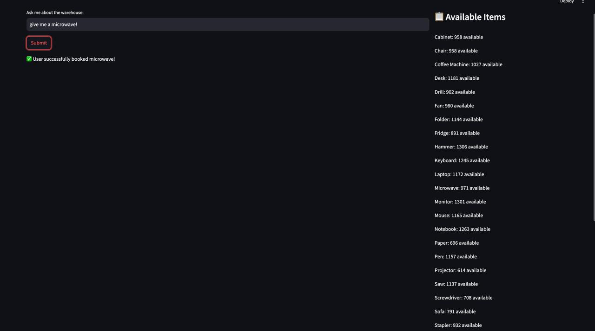
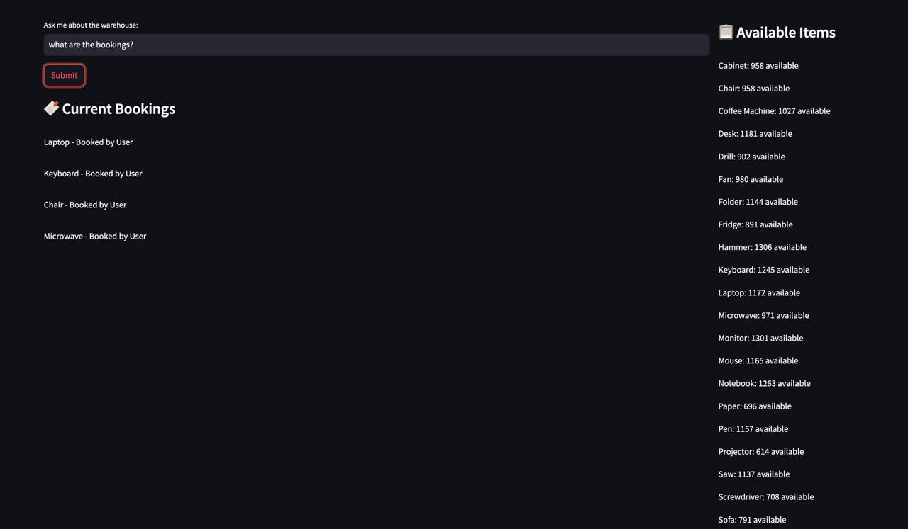
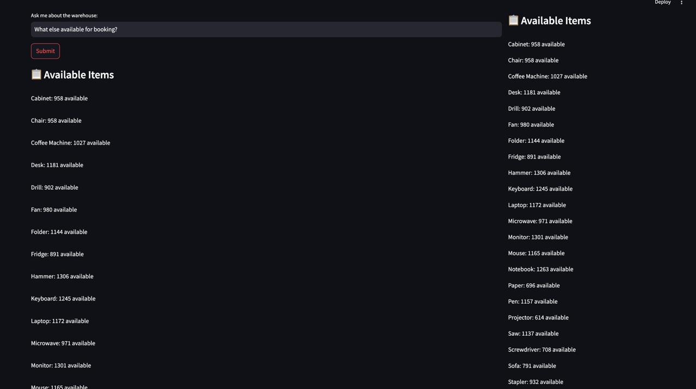
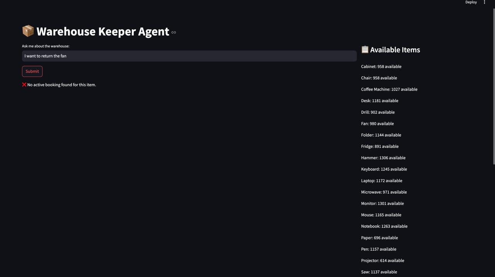
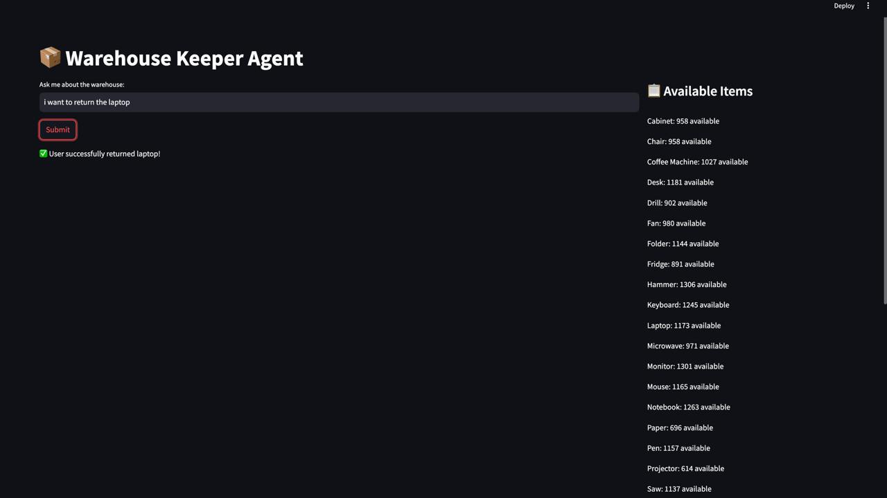

# AI-Powered Warehouse keeper

Book any item from our warehouse!







## Installation Instructions

### Prerequisites

Ensure you have **Python** installed.

### 1. Set Up a Virtual Environment

```sh
python3 -m venv venv
```

#### Activate the Virtual Environment:

- **Windows:**
  ```sh
  venv\Scripts\activate
  ```
- **macOS/Linux:**
  ```sh
  source venv/bin/activate
  ```

### 2. Install Dependencies

```sh
pip install -r requirements.txt
```

### 3. Set environment variable for OpenApi API key

```sh
export OPENAI_API_KEY=<YOUR_OPENAPI_API_KEY>
```

### 4. Run the Application

```sh
streamlit run main.py
```

### 5. Deactivate Virtual Environment (After Use)

```sh
deactivate
```


